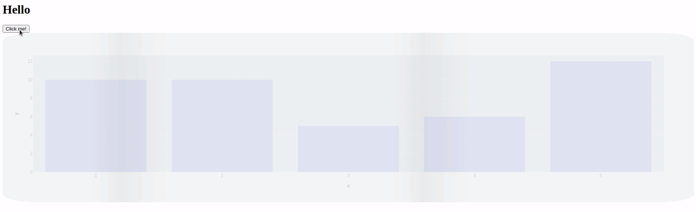

# dash-loading-shimmer

[](https://badge.fury.io/py/dash-loading-extras)


A shimmer pre-load component for Plotly Dash. Check out a *very* minimal example here: https://dash-loading-shimmer.herokuapp.com/



## Installation

Get it with **pip**: `pip install dash-loading-extras`

Or maybe you prefer **Pipenv**: `pipenv install dash-loading-extras`

## Usage

See [sampleapp.py](sampleapp.py) for a simple Dash app example, or use `Shimmer` like you would a `dcc.Loading` component. Wrap it around any components you want to shimmer while loading and don't stop 'til morning.

```python
from dash import Dash, html, dcc
import dash_loading_extras as loading
app = Dash()
app.css.config.serve_locally=True

app.layout = html.Div([
    html.H1("A Long Loading Graph"),
    html.H2("It's worth the wait!"),
    loading.Shimmer(
        dcc.Graph(figure=fig, id="graph"),
        app=app,
        # show_spinner=True # optionally keep the loading animation on top of the shimmering element
    ),
])

app.run_server()
```

If you want to tweak the CSS used, inject your own CSS before `Shimmer` gets there with the `shimmer_css` function. Common styles to tweak are the opacity, hue, and speed of the shimmer

```python
import dash_loading_extras as loading
app = Dash()

loading.ASSETSDIR = "path/to/your/cssassets/folder"
loading.shimmer_css(app=app, path="my_better_shimmer.css")

app.layout = ...

```

## Future Work

Open to ideas! So far there's:

* Customize shimmer styles (programmatically generating CSS at runtime)
* More loaders (spinning, bouncing, erupting?)
* Remove need to pass `app` into `Shimmer` call
